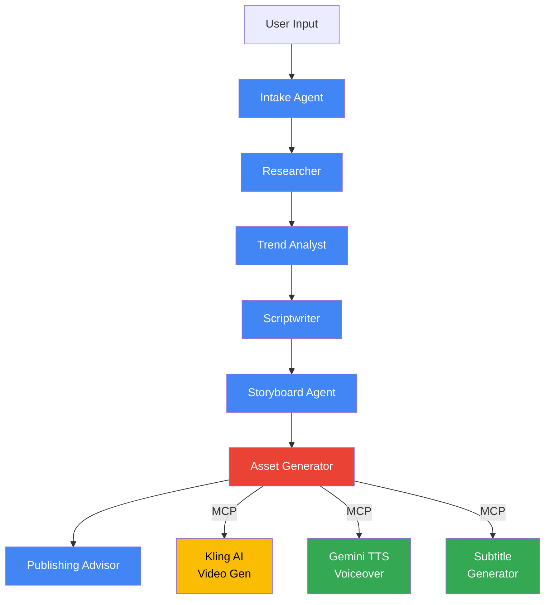

# 🎬 VibeCast — AI Video Creation Agent

> **Kaggle Capstone Project** | AI Agents: Intensive Vibe Coding Course with Google  
> **Track**: Freestyle

VibeCast is a multi-agent video production pipeline built with **Google ADK 2.0** that transforms a simple topic into a fully produced video package — complete with research, script, storyboard, AI-generated video clips, voiceover, subtitles, and publishing recommendations.

## 🏗️ Architecture



**Blue nodes** = LLM Agents (Gemini Flash) | **Red node** = Function Node | **Yellow/Green** = External APIs via MCP

## 📚 Course Concepts Demonstrated

| # | Concept | Where | Details |
|---|---------|-------|---------|
| 1 | **Multi-Agent System (ADK 2.0)** | `app/agent.py` | 7-node `Workflow` graph with `LlmAgent` + function nodes |
| 2 | **MCP Server** | `app/mcp_server/` | Custom `FastMCP` server exposing `generate_video`, `generate_voiceover`, `generate_subtitles` |
| 3 | **Security Features** | `app/security/` | Input sanitization, injection detection, before-tool callbacks, secret management (Day 4 7-Pillar Architecture) |
| 4 | **Deployability** | `Dockerfile` | Cloud Run containerized deployment with health checks |
| 5 | **Agent Skills** | `app/skills/video_production/` | Cinematic scriptwriting skill with platform-specific guidelines |

## 🚀 Quick Start

- Python 3.11+
- [uv](https://docs.astral.sh/uv/) (Python package manager)
- Google AI Studio API key (GEMINI_API_KEY)
- Kling AI API key (optional — mock mode works without it)

### Setup

```bash
# Clone and navigate to the project
cd vibecast

# Copy environment template
cp .env.example .env

# Edit .env with your API keys
# For demo/development, VIBECAST_MOCK_MODE=true works without real keys

# Install dependencies
uv sync

# Run the agent locally with ADK playground
uv run adk web
```

Then open http://localhost:8000 and submit a video topic like:
> "Make a 60 second educational video about quantum computing for tech enthusiasts"

### Running Tests

```bash
# Unit tests
uv run pytest tests/unit/ -v

# Specific test file
uv run pytest tests/unit/test_security.py -v
```

## 🔒 Security Architecture (Day 4)

VibeCast implements the 7-Pillar Security Architecture from the Day 4 whitepaper:

| Pillar | Implementation |
|--------|---------------|
| **Pillar 1 — Sandboxing** | Non-root Docker container, isolated execution |
| **Pillar 4 — Application Runtime** | Input sanitization, injection detection, before-tool callbacks |
| **Pillar 4 — Egress Control** | MCP server is the sole path to external APIs |
| **Pillar 5 — Secret Management** | API keys via `.env` only, never in code |
| **Pillar 6 — Observability** | Structured logging via Python `logging` module |

### Input Sanitization

All tool inputs pass through `app/security/validators.py`:
- Shell metacharacter stripping (`;`, `|`, `&`, `$`, etc.)
- Zero-width Unicode removal (invisible payload defense)
- Prompt injection detection (regex-based pattern matching)
- Length validation (2500 chars for video, 5000 for TTS)

## 📁 Project Structure

```
vibecast/
├── app/
│   ├── __init__.py
│   ├── agent.py                # ADK 2.0 Workflow (7 nodes)
│   ├── schemas.py              # Pydantic models for all node I/O
│   ├── fast_api_app.py         # FastAPI wrapper for Cloud Run
│   ├── mcp_server/
│   │   ├── media_tools_server.py  # FastMCP server (3 tools)
│   │   ├── kling_client.py        # Kling AI async REST client
│   │   └── tts_client.py          # Gemini TTS client
│   ├── security/
│   │   └── validators.py         # Input sanitization + callbacks
│   └── skills/
│       └── video_production/
│           └── SKILL.md          # Cinematic scriptwriting skill
├── tests/
│   ├── unit/
│   │   ├── test_schemas.py
│   │   └── test_security.py
│   └── eval/
│       ├── eval_config.yaml
│       └── datasets/basic.json
├── .env.example
├── .gitignore
├── Dockerfile
├── pyproject.toml
└── README.md
```

## 🎯 How It Works

1. **Intake Agent** — Parses your request into a structured brief (topic, audience, platform, style, duration)
2. **Researcher** — Gathers key facts, sources, and trending points about the topic
3. **Trend Analyst** — Identifies keywords, hook styles, and competitor angles
4. **Scriptwriter** — Creates an engaging script with hook, segments, and CTA
5. **Storyboard Agent** — Converts the script into visual scenes with Kling AI prompts
6. **Asset Generator** — Calls MCP tools to generate video clips (Kling AI), voiceovers (Gemini TTS), and subtitles
7. **Publishing Advisor** — Generates YouTube/social metadata, upload timing, and promotional posts

## 🐳 Cloud Run Deployment

```bash
# Build the container
docker build -t vibecast .

# Test locally
docker run -p 8080:8080 --env-file .env vibecast

# Deploy to Cloud Run
gcloud run deploy vibecast \
    --source . \
    --region us-central1 \
    --allow-unauthenticated \
    --set-env-vars "VIBECAST_MOCK_MODE=true"
```

## 🛠️ Tech Stack

- **Framework**: Google ADK 2.0 (Agent Development Kit)
- **LLM**: Gemini 2.5 Flash (via Google AI Studio API)
- **Video Generation**: Kling AI REST API
- **Voice Generation**: Gemini TTS (gemini-2.5-flash-preview-tts)
- **MCP Server**: FastMCP (Python)
- **Schema Validation**: Pydantic v2
- **HTTP Client**: httpx (async)
- **Deployment**: Docker + Cloud Run
- **Testing**: pytest + ADK eval framework

## 📄 License

Apache License 2.0
