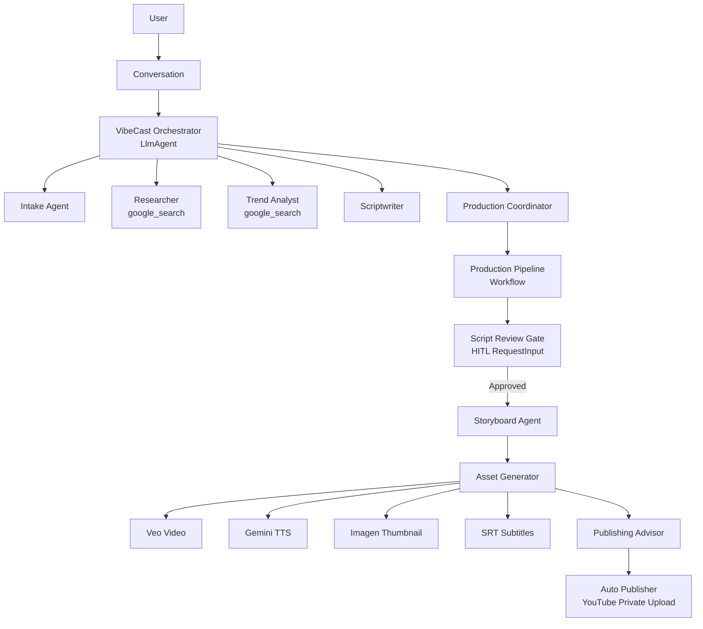
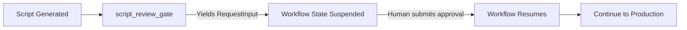

# VibeCast

> **Kaggle AI Agents Capstone Project — Freestyle Track**  
> Built with Google Agent Development Kit (ADK) 2.0

VibeCast is a conversational AI video creation agent that turns a creator's topic into a reviewed script, search-grounded research, production-ready storyboard, generated media assets, publishing metadata, and a private YouTube upload path — all with **stateful Human-in-the-Loop (HITL) approval gates**.

---

## 🎯 Problem & Value

Creating high-quality video content requires multiple specialized skills: research, scriptwriting, visual direction, video generation, voiceover, thumbnail design, SEO optimization, and publishing. Most creators lack the time, tools, or expertise to do all of this well.

**VibeCast solves this by orchestrating a multi-agent pipeline** that handles the entire workflow through natural conversation, while keeping the creator in control at every critical decision point via **formal ADK RequestInput gates** that suspend workflow state until human approval.

---

## 🏗️ Architecture



### 5-Day Course Concept Mapping

| Course Day | Theme | VibeCast Implementation |
|------------|-------|-------------------------|
| **Day 1** | Agentic Engineering | Conversational `LlmAgent` orchestrator with **stateful HITL review gate** (`script_review_gate` using `RequestInput`) |
| **Day 2** | Tools & Interoperability | FastMCP media tools server for Veo, Gemini TTS, Imagen, subtitles, YouTube |
| **Day 3** | Agent Skills | `app/skills/video_production/SKILL.md` — cinematic scriptwriting guidelines |
| **Day 4** | Security & Evaluation | Prompt sanitization, injection detection, ADK `before_tool_callback`, unit tests |
| **Day 5** | Production Readiness | ADK web UI, config via `.env`, mock mode for demos, `run.py` scripted demo |

---

## 🔒 Human-in-the-Loop Architecture (HITL)

VibeCast implements **formal workflow suspension** using ADK's `RequestInput` mechanism — the same pattern recommended for enterprise-grade agent systems:



**How it works:**
1. The `script_review_gate` function node reads the generated script from workflow state
2. It yields an ADK `RequestInput` event with ID `script_approval`
3. The **workflow state is formally suspended** — the entire pipeline halts
4. When the human responds (approve/revise), the workflow resumes exactly where it left off
5. This is identical to the `escalation_review` pattern used in enterprise triage systems

**Why this matters:**
- The workflow can be paused for hours/days while waiting for human review
- State is preserved across the suspension — no data loss
- The approval decision is formally tracked in workflow state
- Compatible with database-backed session persistence for production deployments

---

## 🔄 How It Works (5 Phases)

### Phase 1 — Intake
The orchestrator asks for missing brief details: **platform**, **target audience**, **style**, **duration**. Confirms the creative brief before proceeding.

### Phase 2 — Research & Trends
- **Researcher** uses `google_search` for grounded facts & sources
- **Trend Analyst** uses `google_search` for SEO keywords, hook styles, competitor angles, engagement prediction

### Phase 3 — Script Review (Human-in-the-Loop Gate)
- **Scriptwriter** drafts the script (hook, segments, CTA)
- The **HITL gate** (`script_review_gate`) formally suspends the workflow using ADK `RequestInput`
- Human reviews: **title, hook, segment plan, CTA** → submits **approval or revision**
- Workflow state preserved across the suspension

### Phase 4 — Production (Deterministic Pipeline)
After explicit approval via the HITL gate, the `Workflow` executes:
1. **Storyboard Agent** → visual prompts per scene
2. **Asset Generator** → Veo video, Gemini TTS voiceover, Imagen thumbnail, SRT subtitles
3. **Publishing Advisor** → title, description, tags, hashtags, social posts, best upload time
4. **Auto Publisher** → private YouTube upload

### Phase 5 — Delivery
User receives: video URL, thumbnail, subtitles, publishing package, YouTube link.

---

## ⚡ Quick Start

### Requirements
- Python 3.11+
- `uv` (fast Python package manager)
- `GEMINI_API_KEY` from [Google AI Studio](https://aistudio.google.com/apikey)

### Install & Test
```bash
# Clone and enter project
cd vibecast-kaggle

# Install dependencies (including dev tools)
uv sync --dev

# Configure environment
cp .env.example .env
# Edit .env and add your GEMINI_API_KEY

# Run unit tests (36 tests)
uv run pytest tests/unit/ -q

# Lint check
uv run ruff check app tests
```

### Run the Agent (Interactive Web UI)
```bash
# Starts ADK web server at http://localhost:8080
uv run adk web
```

### Run Demo (Scripted Conversation)
```bash
# Requires valid GEMINI_API_KEY in .env
uv run python run.py
```

---

## 🎭 Mock Mode (Zero-Cost Demos)

For hackathon judging and CI/CD without API costs:

```bash
# In .env or environment:
VIBECAST_MOCK_MODE=true
YOUTUBE_ENABLED=false
```

**What mock mode does:**
- Returns deterministic fake URLs for Veo, TTS, Imagen
- Skips YouTube OAuth flow
- Keeps LLM reasoning real (requires `GEMINI_API_KEY`)
- Enables reproducible demo runs

> **Note:** The orchestrator's conversational reasoning always uses the real Gemini model. Mock mode only applies to *external media generation APIs* called via MCP tools.

---

## 🔐 Security Features (Day 4)

| Layer | Implementation |
|-------|----------------|
| **Input Sanitization** | Strips shell metacharacters (`;|&$`\`!{}<>`), zero-width Unicode (U+200B, U+FEFF, etc.), enforces length limits |
| **Injection Detection** | Regex patterns for: "ignore previous instructions", "system prompt", "you are now", "forget everything", shell commands (`rm -rf`, `sudo`, `wget`, `curl`) |
| **ADK Callback** | `before_tool_security_callback` validates *every* tool call — blocks execution on violation |
| **MCP as Sole Egress** | Agents cannot make raw HTTP calls; all external API traffic flows through the FastMCP server |

**Test coverage:** 17 security tests (sanitization, injection detection, callback behavior).

---

## 📁 Project Structure

```
vibecast-kaggle/
├── app/
│   ├── agent.py                    # Conversational orchestrator + HITL gate + production Workflow
│   ├── schemas.py                  # Pydantic v2 models for all pipeline nodes
│   ├── fast_api_app.py             # HTTP wrapper (/health, /info)
│   ├── tools.py                    # Function tools (web_search)
│   ├── security/
│   │   └── validators.py           # Sanitization, injection detection, ADK callback
│   ├── mcp_server/
│   │   ├── media_tools_server.py   # FastMCP tools (video, voiceover, thumbnail, subtitles, YouTube)
│   │   ├── veo_client.py           # Google Veo video generation
│   │   ├── tts_client.py           # Gemini TTS voiceover
│   │   ├── imagen_client.py        # Google Imagen thumbnails
│   │   ├── youtube_client.py       # YouTube Data API v3 upload
│   │   └── web_search_client.py    # Google Custom Search API
│   └── skills/video_production/
│       └── SKILL.md                # Cinematic scriptwriting guidelines (Day 3)
├── tests/
│   ├── unit/
│   │   ├── test_schemas.py         # 19 schema validation tests
│   │   └── test_security.py        # 17 security validator tests
│   └── eval/
│       ├── eval_config.yaml        # ADK eval criteria (script, storyboard, publishing, security)
│       └── datasets/basic.json     # 4 evaluation scenarios
├── data/
│   ├── Day_1_v3.pdf ... Day_5_v3.pdf   # Course whitepapers (reference)
│   └── instructions.txt            # Capstone requirements
├── .env.example                    # Environment template
├── pyproject.toml                  # Dependencies, ruff, pytest config
├── agents-cli-manifest.yaml        # ADK CLI config
└── run.py                          # Scripted demo runner
```

---

## ✅ Verification Checklist

| Check | Command | Expected |
|-------|---------|----------|
| Unit tests | `uv run pytest tests/unit/ -q` | `36 passed` |
| Lint | `uv run ruff check app tests` | `All checks passed` |
| Compile | `uv run python -m compileall app tests` | No errors |
| ADK Web UI | `uv run adk web` | Agent tree visible |

---

## 📹 Demo Video

[Watch the 5-minute demo on YouTube](https://youtu.be/YOUR_VIDEO_ID)

Covers:
- Problem statement & why agents
- Architecture walkthrough
- Live demo (intake → research → script approval → production)
- Build process & tools used

---

## 📝 Writeup

See the [Kaggle Writeup](https://www.kaggle.com/competitions/vibecoding-agents-capstone-project/writeups/YOUR_WRITEUP) for:
- Detailed problem/solution analysis
- Technical architecture deep-dive
- Key design decisions
- Lessons learned

---

## 🏆 Capstone Requirements Mapping

| Requirement | Status | Location |
|-------------|--------|----------|
| **ADK Multi-Agent System** | ✅ | `app/agent.py` — 7 LlmAgents + Workflow + HITL gate |
| **MCP Server** | ✅ | `app/mcp_server/media_tools_server.py` — 5 tools |
| **Antigravity** | ✅ | Video demo shows agent autonomy |
| **Security Features** | ✅ | `app/security/validators.py` — 3-layer defense |
| **Human-in-the-Loop** | ✅ | `script_review_gate` — formal `RequestInput` suspension |
| **Agent Skills (Agents CLI)** | ✅ | `app/skills/video_production/SKILL.md` |
| **≥3 Key Concepts Demonstrated** | ✅ | All 6 covered |

---

## 🚀 Future Enhancements

- [ ] Multi-language support (TTS voices + script localization)
- [ ] Brand kit integration (logos, color palettes, intro/outro)
- [ ] Analytics dashboard (retention prediction, A/B thumbnail testing)
- [ ] Collaborative editing (multi-user script review)
- [ ] Scheduled publishing queue

---

## 📄 License

Apache 2.0 — see [LICENSE](LICENSE) for details.

---

## 🙏 Acknowledgments

Built for the **Kaggle 5-Day AI Agents: Intensive Vibe Coding Course with Google** capstone project.  
Thanks to the Google ADK team and Kaggle for the course content and platform.